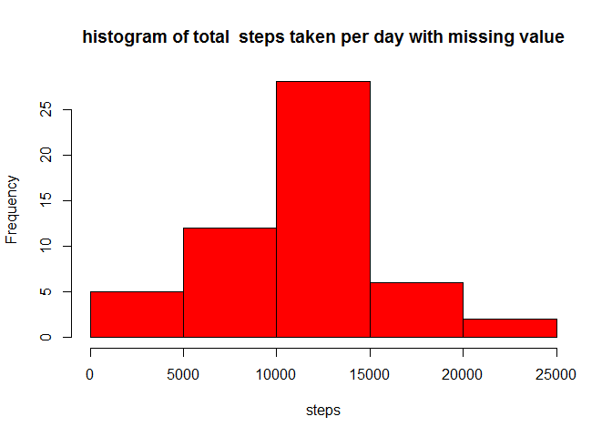
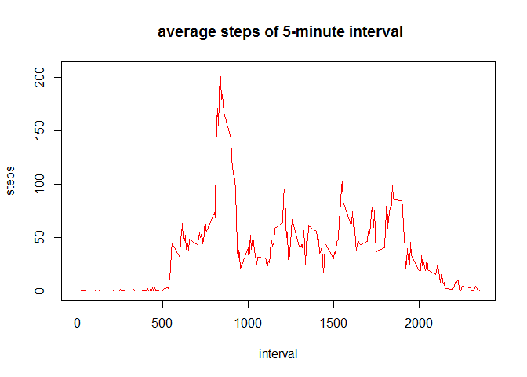
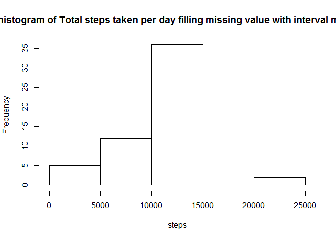
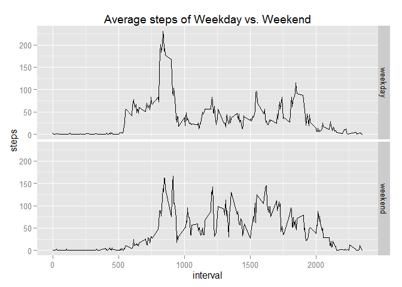

# Reproducible Research: Peer Assessment 1


## Loading and preprocessing the data

### - Show any code that is needed to Load the data (i.e. read.csv())


```r
a=read.csv("C:\\Users\\user\\Documents\\activity.csv")
```


## What is mean total number of steps taken per day?
### 1. Calculate the total number of steps taken per day

```r
b=aggregate(a$steps,by=list(a$date),sum)
names(b)=c("date","steps") 
b
```

```
##          date steps
## 1  2012-10-01    NA
## 2  2012-10-02   126
## 3  2012-10-03 11352
## 4  2012-10-04 12116
## 5  2012-10-05 13294
## 6  2012-10-06 15420
## 7  2012-10-07 11015
## 8  2012-10-08    NA
## 9  2012-10-09 12811
## 10 2012-10-10  9900
## 11 2012-10-11 10304
## 12 2012-10-12 17382
## 13 2012-10-13 12426
## 14 2012-10-14 15098
## 15 2012-10-15 10139
## 16 2012-10-16 15084
## 17 2012-10-17 13452
## 18 2012-10-18 10056
## 19 2012-10-19 11829
## 20 2012-10-20 10395
## 21 2012-10-21  8821
## 22 2012-10-22 13460
## 23 2012-10-23  8918
## 24 2012-10-24  8355
## 25 2012-10-25  2492
## 26 2012-10-26  6778
## 27 2012-10-27 10119
## 28 2012-10-28 11458
## 29 2012-10-29  5018
## 30 2012-10-30  9819
## 31 2012-10-31 15414
## 32 2012-11-01    NA
## 33 2012-11-02 10600
## 34 2012-11-03 10571
## 35 2012-11-04    NA
## 36 2012-11-05 10439
## 37 2012-11-06  8334
## 38 2012-11-07 12883
## 39 2012-11-08  3219
## 40 2012-11-09    NA
## 41 2012-11-10    NA
## 42 2012-11-11 12608
## 43 2012-11-12 10765
## 44 2012-11-13  7336
## 45 2012-11-14    NA
## 46 2012-11-15    41
## 47 2012-11-16  5441
## 48 2012-11-17 14339
## 49 2012-11-18 15110
## 50 2012-11-19  8841
## 51 2012-11-20  4472
## 52 2012-11-21 12787
## 53 2012-11-22 20427
## 54 2012-11-23 21194
## 55 2012-11-24 14478
## 56 2012-11-25 11834
## 57 2012-11-26 11162
## 58 2012-11-27 13646
## 59 2012-11-28 10183
## 60 2012-11-29  7047
## 61 2012-11-30    NA
```


## What is the average daily activity pattern?
### 2. Make a histogram of the total number of steps taken each day

```r
hist(b$steps,col="red",xlab="steps",main="total number of steps taken per day")
```

 

### 3. Calculate and report the mean and median of the total number of steps taken per day


```r
day_mean=mean(b$steps,na.rm=T)
## force to express result without scientific notation with option scipen
day_mean=format(day_mean,scipen=100,digits=5)
day_median=median(b$steps,na.rm=T)
```
### The mean of days is 10766

### The median of days is 10765

## What is the average daily activity pattern?

### Make a time series plot (i.e. type = "l") of the 5-minute interval (x-axis) and the average number of steps taken, averaged across all days (y-axis)

```r
library(reshape2)
```

```
## Warning: package 'reshape2' was built under R version 3.1.2
```

```r
md=melt(a,id.vars=c("date","interval"),na.rm=T)
new=dcast(md,interval~variable,mean)
plot(new,type="l",col="red",main=" average steps of 5-minute interval")
```

 


## Imputing missing values


```r
## nof subset of record contain NA
nof=a[is.na(a$steps)==T,]
number=nrow(nof) ## total records that contain NA
```

### 1.The total number of missing values in the dataset is 2304 

### 2. Devise a strategy for filling in all of the missing values in the dataset using the mean/median for that day, or the mean for that 5-minute interval, etc.
### 3. Create a new dataset that is equal to the original dataset but with the missing data filled in.

```r
##let dataframe a add a  interval average steps column
library(dplyr)
```

```
## Warning: package 'dplyr' was built under R version 3.1.3
```

```
## 
## Attaching package: 'dplyr'
## 
## The following object is masked from 'package:stats':
## 
##     filter
## 
## The following objects are masked from 'package:base':
## 
##     intersect, setdiff, setequal, union
```

```r
a=tbl_df(a)
new=tbl_df(new)
extstep=new
for(i in 1:60){extstep=rbind(extstep,new)}
names(extstep)=c("interval","mean")
exta=cbind(a,extstep$mean)
names(exta)=c("steps","date","interval","mstep")
extab=filter(exta,is.na(steps))
extab=mutate(extab,steps=mstep)
extab=select(extab,steps,date,interval)
isa=filter(a,!is.na(steps))
data=arrange(rbind(isa,extab),date,interval)
head(data)
```
### 4. Make a histogram of the total number of steps taken each day and Calculate and report the mean and median total number of steps taken per day.


```r
data_mean=group_by(data,date)
sumsteps=summarise(data_mean,sum(steps))
names(sumsteps)=c("date","total")
hist(sumsteps$total)
```

 

```r
filled_mean=mean(sumsteps$total)
filled_mean=format(filled_mean,scipen=100)
filled_median=median(sumsteps$total)
filled_median=format(filled_median,scipen=100)
```
### the mean  total number of steps taken per day is 10766.19
### the median total number of steps taken per day is 10766.19


## Are there differences in activity patterns between weekdays and weekends?
### For this part the weekdays() function may be of some help here. Use the dataset with the filled-in missing values for this part.

### Create a new factor variable in the dataset with two levels - "weekday and weekend"  indicating whether a given date is a weekday or weekend day.

```r
##change environment from Chinese to English
Sys.setlocale(,"USA")
```

```
## [1] "LC_COLLATE=English_United States.1252;LC_CTYPE=English_United States.1252;LC_MONETARY=English_United States.1252;LC_NUMERIC=C;LC_TIME=English_United States.1252"
```

```r
data=mutate(data,week= weekdays(as.Date(date)) %in% c("Saturday" , "Sunday"))  
data$week=factor(data$week)
levels(data$week)=c("weekday","weekend")
Sys.setlocale(,"CHT")## change back to Chinese environment with "CHT"
```

```
## [1] "LC_COLLATE=Chinese (Traditional)_Taiwan.950;LC_CTYPE=Chinese (Traditional)_Taiwan.950;LC_MONETARY=Chinese (Traditional)_Taiwan.950;LC_NUMERIC=C;LC_TIME=Chinese (Traditional)_Taiwan.950"
```

### Make a panel plot containing a time series plot (i.e. type = "l") of the 5-minute interval (x-axis) and the average number of steps taken, averaged across all weekday days or weekend days (y-axis)


```r
fff=aggregate(data$steps,by=list(data$interval,data$week),mean)
names(fff)=c("interval","wday","steps")
library(ggplot2)
```

```
## Warning: package 'ggplot2' was built under R version 3.1.3
```

```r
g=ggplot(fff,aes(interval,steps))
g+geom_line()+facet_grid(wday~.)+labs(title="Average steps of Weekday vs. Weekend")
```

 
